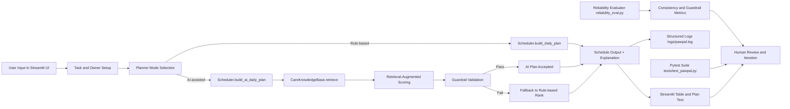
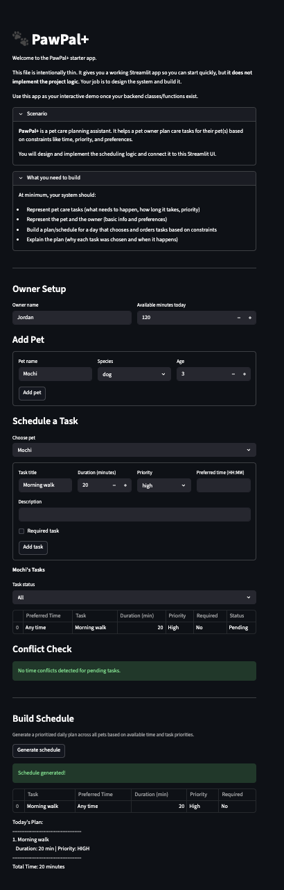

# PawPal+ Applied AI Scheduler

PawPal+ is an applied AI pet-care planning assistant built with Streamlit and Python. It helps owners coordinate daily care tasks across multiple pets while balancing urgency, available time, and scheduling conflicts. The system matters because it combines transparent rule-based planning with AI-assisted retrieval and reliability checks, so decisions are both useful and auditable.

## Original Project (Modules 1-3)

Original project name: **PawPal Starter Scheduler** (from earlier Module 1-3 coursework).

The original version focused on object-oriented scheduling fundamentals: tasks, pets, owners, and a basic priority-based daily plan. It could rank tasks, sort by preferred time, and show simple conflict warnings, but it did not include retrieval-augmented reasoning, guardrail-based fallback, or formal reliability evaluation. This final version extends that prototype into a complete applied AI system with integrated AI behavior and testing workflows.

## Title and Summary

### What the project does

- Collects owner and pet profiles.
- Accepts pet-care tasks with priority, duration, preferred time, recurrence, and required flags.
- Generates schedules in rule-based mode.
- Generates schedules in AI-assisted mode using retrieval-augmented scoring.
- Validates AI outputs with guardrails and safely falls back when needed.
- Logs planner behavior and runs reliability experiments.

### Why it matters

Pet-care planning is a real multi-constraint decision problem. PawPal+ shows how to build AI features responsibly: retrieval that changes behavior, guardrails that enforce safety, and tests/evaluations that verify reliability.

## Architecture Overview

System architecture files:

- [assets/diagrams/system_architecture.mmd](assets/diagrams/system_architecture.mmd)
- [assets/diagrams/uml_final.mmd](assets/diagrams/uml_final.mmd)



How data flows through the system:

1. UI collects owner constraints and pet tasks.
2. Planner mode routes execution into either rule-based or AI-assisted scheduling.
3. AI-assisted mode retrieves relevant care guidance and boosts task scores.
4. Guardrails validate the result and trigger fallback if checks fail.
5. Final plan is displayed, explained, and logged.
6. Reliability script and tests produce metrics for human review.

Where humans/testing check AI results:

- Human user reviews schedule tables and rationale in the app.
- [tests/test_pawpal.py](tests/test_pawpal.py) verifies behavior including AI prioritization and fallback.
- [reliability_eval.py](reliability_eval.py) measures consistency, guardrail failure rate, and fallback usage.

## Setup Instructions

### 1. Clone and enter the project

```bash
git clone <your-repo-url>
cd applied-ai-system-project
```

### 2. Create and activate a virtual environment

```bash
python -m venv .venv
source .venv/bin/activate
```

### 3. Install dependencies

```bash
pip install -r requirements.txt
```

### 4. Run the app

```bash
streamlit run app.py
```

### 5. Run automated tests

```bash
python -m pytest -q
```

### 6. Run reliability evaluation

```bash
python reliability_eval.py
```

### 7. Inspect logs

Planner events are written to:

```text
logs/pawpal.log
```

## Sample Interactions

### Example 1: AI-assisted medication prioritization

Input:

- Pet: dog
- Task A: Evening play (medium priority)
- Task B: Give medication (low priority, medication keyword)
- Mode: AI-assisted

Resulting AI output:

- "Give medication" is ranked before "Evening play" because retrieval guidance boosts medication urgency.

### Example 2: Guardrail validation and safe fallback

Input:

- Task with invalid priority (`urgent`) and invalid preferred time (`25:99`)
- Mode: AI-assisted

Resulting AI output:

- Guardrails fail validation.
- Scheduler falls back to rule-based ranking.
- Guardrail issues are surfaced in UI and logs.

### Example 3: Reliability metrics from batch evaluation

Input command:

```bash
python reliability_eval.py
```

Resulting output:

- Trials: 20
- Unique plan orderings: 1
- Consistency rate: 100.00%
- Guardrail failure rate: 0.00%
- Fallback usage rate: 0.00%

## Design Decisions and Trade-Offs

### Key design decisions

- Kept a rule-based baseline planner for transparency and predictable behavior.
- Added retrieval-augmented scoring in the same scheduler path so AI directly affects ranking.
- Added guardrails and fallback to ensure invalid AI outputs never become final plans.
- Added structured logs and reliability experiments to support trust and debugging.

### Trade-offs

- Retrieval corpus is lightweight and local (fast, explainable), but less expressive than external knowledge sources.
- Conflict detection checks exact preferred-time matches; it does not yet compute overlap intervals.
- AI-assisted scoring is deterministic and auditable, but less flexible than full generative planning.

## Reliability and Evaluation

This project demonstrates reliability using four methods:

- Automated tests: [tests/test_pawpal.py](tests/test_pawpal.py) validates rule-based behavior, AI prioritization, and guardrail fallback.
- Batch reliability checks: [reliability_eval.py](reliability_eval.py) measures consistency and failure rates across repeated trials.
- Logging and error visibility: planner events and guardrail issues are written to [logs/pawpal.log](logs/pawpal.log).
- Human evaluation: schedule outputs and AI rationale are reviewed in the Streamlit UI before final use.

Current reliability snapshot:

- 14 out of 14 automated tests passed.
- Reliability evaluation (20 trials) produced 1 unique plan ordering.
- Consistency rate was 100.00%.
- Guardrail failure rate was 0.00% and fallback usage rate was 0.00%.

Interpretation:

The system is stable on covered scenarios and reliably enforces validation rules. The current limitation is scope breadth: reliability metrics are strong for tested inputs, but future work should add harder edge cases (missing context, noisy task text, and duration-overlap conflicts).

## Testing Summary

What worked:

- Core OOP task management, recurrence, filtering, sorting, and conflict checks.
- AI-assisted medication prioritization behavior.
- Guardrail-triggered fallback behavior.
- Reliability script execution and metric reporting.

What did not work initially:

- Initial retrieval urgency weight for medication was too low to consistently outrank medium-priority play tasks.

What was learned and improved:

- Tuned retrieval boost weights to align behavior with expected care urgency.
- Added direct tests for AI-specific behavior to prevent regression.
- Confirmed reproducibility by running reliability trials.

## Reflection

This project reinforced that practical AI engineering is mostly systems design, not just model output. Reliable behavior came from integrating retrieval into core logic, enforcing guardrails, and validating outcomes with tests and experiments. The biggest lesson was to keep AI components observable and reversible: every AI decision path should be explainable, logged, and safely recoverable.

## Project Structure

- [app.py](app.py): Streamlit interface and interactive workflow.
- [pawpal_system.py](pawpal_system.py): Domain classes, scheduler, retrieval, and guardrails.
- [main.py](main.py): CLI demonstration.
- [reliability_eval.py](reliability_eval.py): Reliability experiment runner.
- [tests/test_pawpal.py](tests/test_pawpal.py): Unit and AI-behavior tests.
- [assets/diagrams/system_architecture.mmd](assets/diagrams/system_architecture.mmd): Architecture flow diagram.
- [assets/diagrams/uml_final.mmd](assets/diagrams/uml_final.mmd): Class-level design diagram.
- [assets/screenshots/pawpal_app_screenshot.png](assets/screenshots/pawpal_app_screenshot.png): UI screenshot.

## Demo

Loom walkthrough (end-to-end system run):

- https://www.loom.com/share/e5282038976e49ab9ec9f956f0852a4c
  

